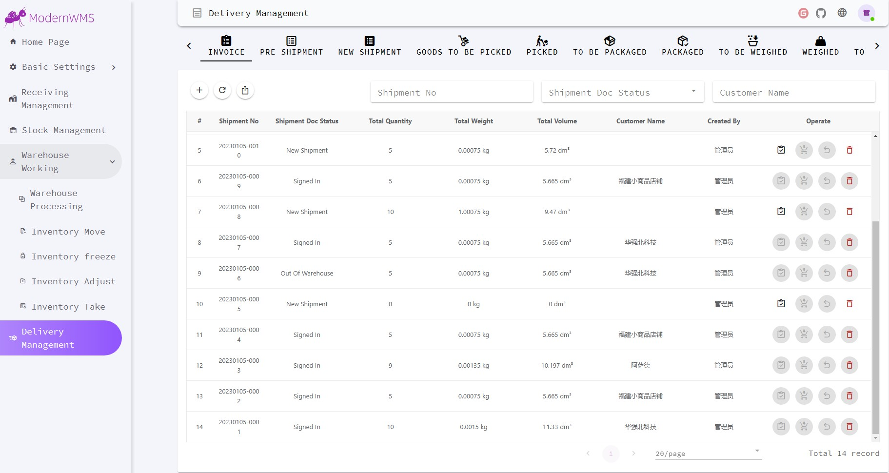
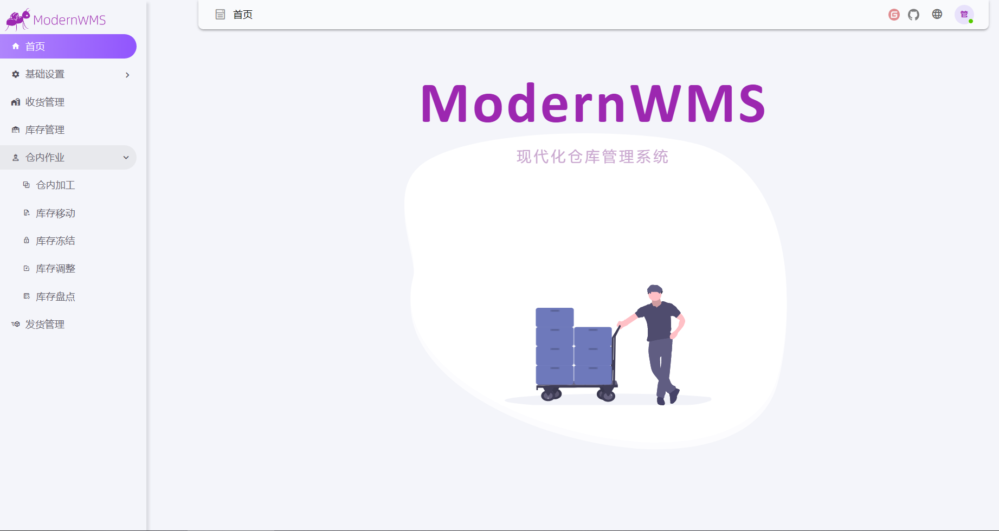
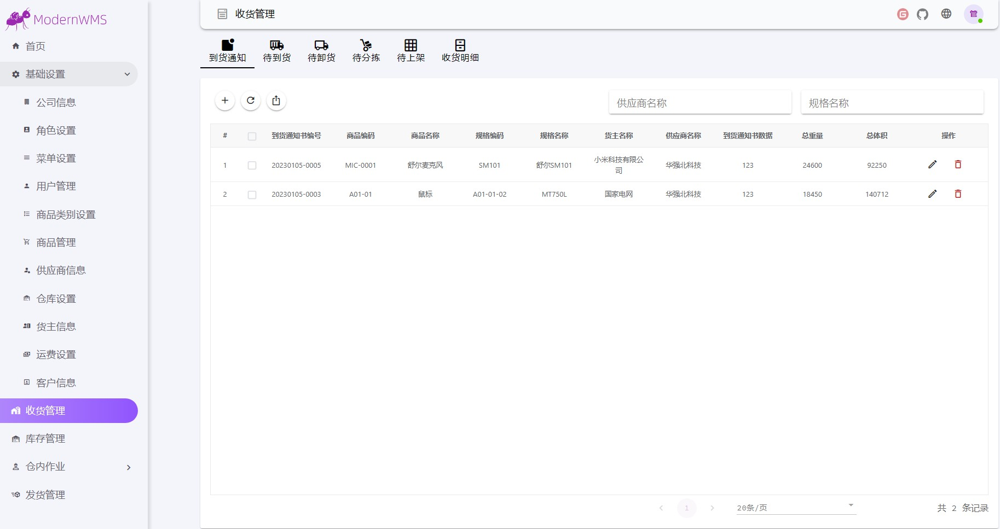

# ModernWMS (Customized Version) - Warehouse Management System

<div align="center">
  
  <h1>ModernWMS - Customized by Siva Surya Varikooti</h1>
</div>

## 📌 Overview
ModernWMS is a Warehouse Management System designed to simplify inventory tracking, order processing, and supply chain workflows.  
This customized version includes my own improvements in **UI styling, setup documentation, and deployment process**.  

> ⚠️ Based on the original open-source [ModernWMS](https://gitee.com/modernwms/ModernWMS) project. Credits to the original developers.

---

## 🛠 Requirements
**For Windows:**
- Windows 10 (1607+) or Windows 11 (21H2+)
- .NET SDK 7+
- Node.js 16+
- Yarn package manager

**For Docker (Optional):**
- Docker installed on your system

---

## 🚀 Installation

### **Windows Setup**
1. **Download Source Code**
   ```powershell
   cd C:\
   wget -Uri https://gitee.com/modernwms/ModernWMS/repository/archive/master.zip -OutFile master.zip
   Expand-Archive -Path C:\master.zip -DestinationPath C:\
   Install Dependencies

powershell
Copy
Edit
# Install .NET SDK
wget -Uri https://download.visualstudio.microsoft.com/.../dotnet-sdk-7.0.101-win-x64.exe -OutFile dotnet-sdk-7.0.101-win-x64.exe
.\dotnet-sdk-7.0.101-win-x64.exe /install /quiet /norestart

# Install Node.js & Yarn
wget -Uri https://nodejs.org/dist/v16.13.1/node-v16.13.1-x64.msi -OutFile node-v16.13.1-x64.msi
msiexec /i .\node-v16.13.1-x64.msi /passive /norestart
npm install -g yarn
Compile Frontend & Backend

powershell
Copy
Edit
cd C:\ModernWMS-master\backend
dotnet publish
cd C:\ModernWMS-master\frontend
yarn
yarn build
Run Application

Backend: dotnet ModernWMS.dll --urls http://0.0.0.0:20011

Frontend: Serve with Nginx or similar

Docker Deployment (Optional)
Install Docker

Pull prebuilt image:

bash
Copy
Edit
docker pull modernwms/modernwms:1.0
docker run -d -p 20011:20011 -p 80:80 modernwms/modernwms:1.0 ./run.sh
📖 Usage
Open in browser:

perl
Copy
Edit
http://127.0.0.1  OR  http://<your-server-ip>

Username: admin

Password: 1

Default Login:
📷 Screenshots
  


